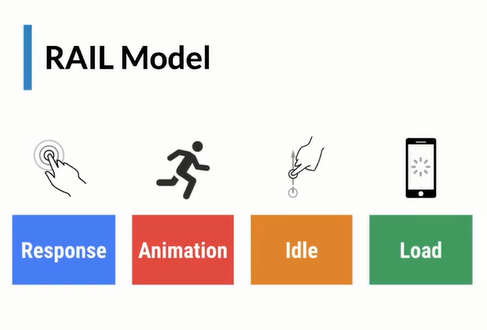

# Librerias y frameworks

## Ecosistema en JS

### Empaquetadores

* Webpack
* Parcel
* Rollup

### Compiladores

* BABEL (Transpilador)
  * Permite usar las features del lenguaje mas modernas.
* Typescript (Superset JS, Type Checker)

### Herramientas desarrollo UI

* React.js
* Vue.js
* Svelte
* Polymer

### CSS preprocesadores

* SASS
* LESS
* Stylus

### CSS in JS

* Styled Components
* Emotion

### Routers

* React Router
* Vue Router
* Svelte Router

### Frameworks

* Angular

### Entornos de desarrollo

* Create React App
* Vue CLI
* Svelte CLI
* Whatever CLI

### Manejo de estado

* Redux
* Xstate

### Consulta de datos

* Rest API
* GraphQL
