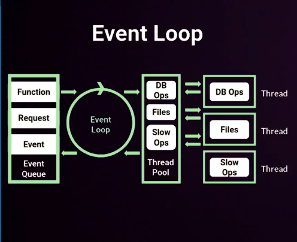

# 2. EventLoop: Asíncronia por diseño

Es un proceso con un bucle que gestiona de forma asíncrona todos los eventos de tu aplicación.

## Monohilo: Implicaciones en diseño y seguridad

> La ejecución monohilo y el asincronismo de Node.js puede llegar a ser una desventaja si no se tiene claro lo que esta pasando.

Cuando ocurre un error dentro de alguno de los hilos y no se controla apropiadamente (catch); Node detiene todos los hilos ejecución.

**Esto puede ser muy peligroso**, debido a que es dificil determinar fue el origen del problema y en que punto de ejecución se encontraba cada hilo cuando fue detenido.
